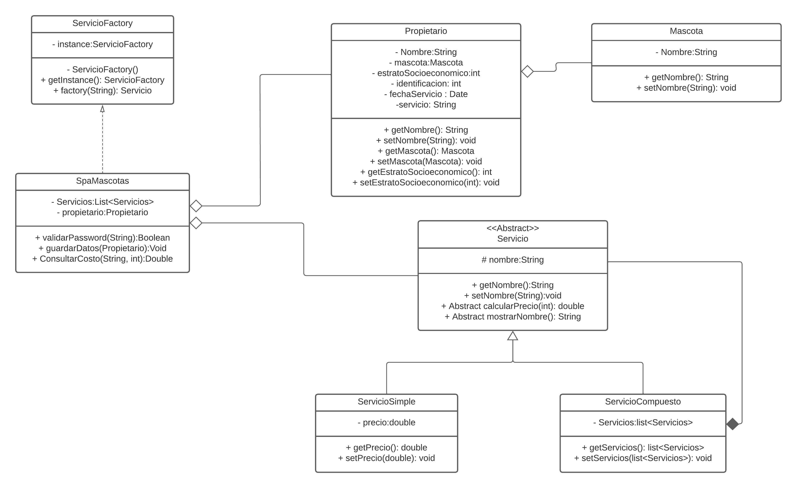

# ProyectoSpaMascotas
Programa creado utilizando C#
Proyecto de programación en el cual se utilizan patrones de diseño para dar una solución óptima al problema presentado de Spa Mascotas, los patrones de diseño implementados son: Composite, Factory y Singleton, los cuales se pueden evidenciar en el siguiente diagrama de clases.

